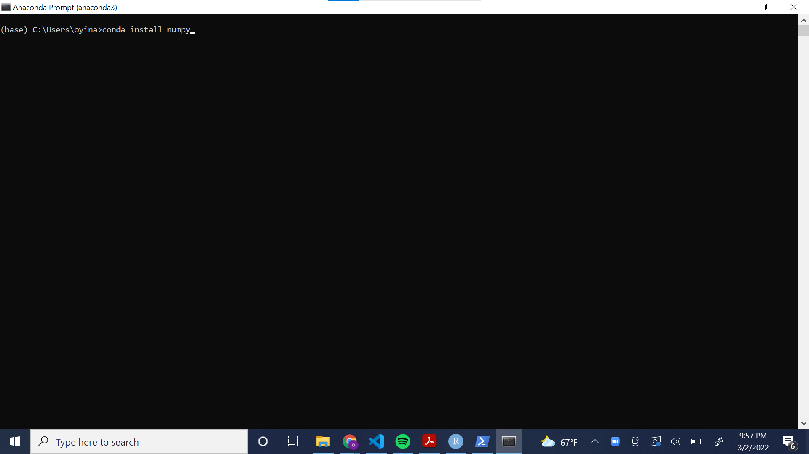

# Basics 

```{r,echo=FALSE}
knitr::opts_chunk$set(comment = '##', prompt = FALSE, collapse = FALSE)
```

This chapter covers the very basics of Python and R.

## Math

Mathematical operators are the same in both languages except for exponents, integer division, and remainder division (modulo).

#### Python {-}

Python uses `**` for exponentiation, `//` for integer division, and `%` for remainder division.

```{python}
3**2
5 // 2
5 % 2
```

In Python, the `+` operator can also be used to combine strings. **See this TBD section.**

#### R {-}

Python uses `^` for exponentiation, `%/%` for integer division, and `%%` for remainder division.

```{r}
3^2
5 %/% 2
5 %% 2
```

## Missing values

Python and R represent missing values differently, and the distinction is worth keeping in mind, as missing values appear throughout this book---some code examples intake or output data that are entirely or partially missing. In Python, a standard indicator for a missing value in a data set is `NaN`. In R, missing values are generally indicated by `NA`. `NaN` does appear in R as well, but R reserves `NaN` to indicate values that, while not technically absent, are undefined and/or can't be represented with numbers (e.g., `Inf/Inf`).

## Assignment

Python uses `=` for assignment, while R can use either `=` or `<-` for assignment. The latter "assignment arrow" is preferred in most R style guides to distinguish between assignment and setting the value of a function argument. According to R's documentation, "The operator `<-` can be used anywhere, whereas the operator `=` is only allowed at the top level (e.g., in the complete expression typed at the command prompt) or as one of the subexpressions in a braced list of expressions." (See `?assignOps` in R.)

#### Python {-}

```{python}
x = 12
```

#### R {-}

```{r}
x <- 12
```

## Printing a value

To see the value of an object created via assignment, you can simply enter the object name in the console and hit enter in both Python and R. It is common in Python, however, to explicitly use the `print()` function.

#### Python {-}

```{python}
x
```

#### R {-}

```{r}
x
```

## Packages

User-created functions can be bundled and distributed as packages. Packages need to be installed only once. Thereafter they're "imported" (Python) or "attached" (R) in each new session when needed.

Packages with large user bases are often updated to add functionality and to fix bugs. The updates are not automatically installed. Staying apprised of library/package updates can be challenging. To stay up to date, you might consider signing up for newsletters, following developers on Twitter, or periodically checking to see what updates are available.

Packages often depend on other packages. These are known as "dependencies." Packages are sometimes updated to accommodate changes to other packages they depend on.

#### Python {-}

When you download Python, you gain access to the Python Standard Library. This library includes several data types and functions for storing data, performing mathematical operations, and beyond. Commonly used data types include _lists_ and _ranges_. As you can see below, you do not need to import data types from the Python Standard Library.

```{python}
my_list = []
for idx in range(5):
  my_list.append(idx)
print(my_list)
```

Libraries contain modules---groups of functions. To use functions from modules in the Python Standard Library, users must import the appropriate module. Examples include **math** and **itertools**.

```{python}
import math
one = 1
two = 2
print(math.pow(two, one))
```

Users can also download hundreds of libraries outside of the Python Standard Library. Python libraries are also called packages. Popular libraries include **NumPy**, which provides functions for operating on arrays/vectors, and **pandas**, which provides functions for data analysis. The following code gives an example of importing a Python library, **NumPy**, into a Python script, and using one of its functions to create an array (a data structure discussed in Chapter 2).

```{python}
import numpy as np

my_array = np.array([1, 2, 3])
print(my_array)
```

To use Python libraries outside the Python Standard Library, you must install them. Package managers help shepherd along the process. _Anaconda_, for example, is a popular distribution of Python that includes a package manager called _conda_. Anaconda allows you to use and create Python environments and install libraries to these environments. A Python virtual environment is a collection of libraries isolated from other virtual environments. These environments allow users to seamlessly organize programming projects.

You can download Anaconda from the following link: https://www.anaconda.com/products/individual. When you download Anaconda, you have access to the Anaconda Navigator, a graphical user interface, and the Anaconda Prompt, a command prompt. Anaconda comes with an automatic environment called "base."

The following screenshot illustrates how to install a library to an environment using the Anaconda GUI. Using the drop down menu, navigate to "Not installed." Then, select the desired library from the list. You can use the search bar to search for libraries by name. Finally, click the green "Apply" button to install the package.

```{r, echo = F}

```

The following screenshot illustrates how to install a library to the "base" environment using the Anaconda Command Prompt.

```{r, echo = F}

```

Sometimes, the commands to download libraries are not as simple as in the example above. The Anaconda website provides commands for how to download popular Python libraries.

#### R {-}

The main repository for R packages is the [Comprehensive R Archive Network](https://cran.r-project.org/) (CRAN). Another major repository is [Bioconductor](https://www.bioconductor.org/), which hosts packages for working with genomic data. Many packages are also distributed on [GitHub](https://github.com/).

To install packages from CRAN use the `install.packages()` function. In RStudio, you can also go to _Tools...Install Packages..._ to bring up a dialog box that will auto-complete package names as you type.

```{r eval=FALSE}
# Install the vcd package, a package for Visualizing Categorical Data
install.packages("vcd")

# Load the package
library(vcd)

# See which packages on your computer have updates available
old.packages()

# Download and install available package updates;
# Set ask = TRUE to verify installation of each package
update.packages(ask = FALSE)
```

To install R packages from GitHub, use the `install_github()` function from the **devtools** package. You need to include the username of the repo owner followed by a forward slash and the name of the package. Typing two colons between a package and a function in the package allows you to use that function without attaching the package in your R environment. That's how we access `install_github()` in the example below.

```{r eval=FALSE}
install.packages("devtools")
devtools::install_github("username/packagename")
```

When installing package updates, you will occasionally be asked, "Do you want to install from sources the package(s) which need(s) compilation?" R packages on CRAN are _compiled_ for Mac and Windows operating systems. That can take a day or two after a package has been submitted to CRAN. If you try to install a package that has not yet been compiled, you'll be asked the question above. If you click _Yes_, R will try to compile the package on your computer. This will only work if you have the required build tools on your computer. For Windows, this means having [Rtools](https://cran.r-project.org/bin/windows/Rtools/) installed. Mac users should already have the necessary build tools. Unless you absolutely need the latest version of a package, it's generally fine to click _No_.

## Logic

Python and R share the same relational operators for making comparisons: 

- `==` (equals)
- `!=` (not equal to)
- `<` (less than)
- `<=` (less than or equal to)
- `>` (greater than)
- `>=` (greater than or equal to)

Likewise they share the same operators for logical AND and OR:

- `&` (AND)
- `|` (OR)

However R also has `&&` and `||` operators for programming control-flow. These operators _short-circuit_ and return the first result of a set of logical evaluations. For example:

```{r}
c(1, 9, 9) && c(1, 8, 8) == 1
c(1, 9, 9) & c(1, 8, 8) == 1
```

Python and R have different operators for negation. Python uses `not`. R uses `!`.

#### Python {-}

Python's relational operators can be used to compare arrays to single values or other arrays. The following operation returns an **NumPy** array containing `True` and `False` values. 

```{python}
import numpy as np 

# Comparison of array to single value
x1 = np.array([1, 5, 9, 12, 11, 6])
x1 < 8

# Comparison of array to another array 
x2 = np.array([2, 4, 6, 14, 15, 7])
x1 > x2
```

We can make multiple comparisons with the `and` and `or` operators. An important thing to note is that the `and` operator is inclusive, meaning that all statements must be true to return `True`. The `or` operator is exclusive, meaning that just one of the statements joined by `or` must be true to return `True`. 

```{python}
x = 5 
y = 4

x > 6 and y < 10

x > 6 or y < 10
```

`True` and `False` have numeric values of 1 and 0, respectively. This allows us to sum and average these values.

```{python}
# Sum of values greater than 10 in array x2
np.sum(x2 > 10)

# Proportion of values greater than 10 in array x2
np.mean(x2 > 10)
```

#### R {-}

R's relational operators allow comparisons between a vector and a single value, or comparisons between two vectors. The result is a vector of `TRUE`/`FALSE` values.

```{r}
# Vector compared with a value
x1 <- c(1, 5, 9, 12, 11, 6)
x1 < 8

# Vector compared with another vector
x2 <- c(2, 4, 6, 14, 15, 7)
x1 > x2
```

Comparisons with `NA` (a missing value) return `NA`.

```{r}
x1 <- c(1, 5, 9, NA, 11, 6)
x1 < 8
```

Multiple comparisons can be made with the AND (`&`) and OR (`|`) operators.

```{r}
x2 > 3 & x2 < 10
x2 < 3 | x2 > 10
```

`TRUE`/`FALSE` values in R have numeric values of 1 and 0, respectively. This allows us to sum and average them. (An average of 0 and 1 values is the proportion of 1's.)

```{r}
# Sum of values greater than 10
sum(x2 > 10)

# Proportion of values greater than 10
mean(x2 > 10)
```

The `!` operator indicates negation. This allows us to check whether something is _not_ `TRUE`.

```{r}
# Which values are not less than 6?
!x2 < 6
```

See the `?Comparison` and `?Logic` help pages for more information.

## Generating a sequence of values

In Python, one option for generating a sequence of values is `arange()` from **NumPy**. In R, a common approach is to use `seq()`. The sequences can be incremented by indicating a `step` argument in `arange()` or a `by` argument in `seq()`. Be aware that the end of the start/stop interval in `arange()` (Python) is _open_, but both sides of the from/to interval in `seq()` (R) are _closed_.

#### Python {-}

```{python}
import numpy as np
x = np.arange(start = 1, stop = 11, step = 2)
x
```

#### R {-}

```{r}
x <- seq(from = 1, to = 11, by = 2)
x
```

## Calculating means and medians

The **NumPy** Python library has functions for calculating means and medians, and base R has functions for doing the same.

#### Python {-}

Mean, using function from **NumPy**:

```{python}
import numpy as np
x = [90, 105, 110]
x_avg = np.mean(x)
print(x_avg)
```

Median, using function from **NumPy**:

```{python}
x = [98, 102, 20, 22, 304]
x_med = np.median(x)
print(x_med)
```

#### R {-}

Mean, using function from base R:

```{r}
x <- c(90, 105, 110)
x_avg <- mean(x)
x_avg
```

Median, using function from base R:

```{r}
x <- c(98, 102, 20, 22, 304)
x_med <- median(x)
x_med
```

## Writing your own functions

Python and R allow and encourage users to create their own functions. Functions can be created, named, and stored in memory for use throughout a session. Or they can be created on-the-fly "anonymously" and used once.

#### Python {-}

Functions in Python are defined by using the `def` keyword followed by the intended name of the function with its arguments inside parentheses. We must include a `return()` statement after the body of our function to indicate the end of the function. The return statement takes an optional argument in its parentheses that will be the output of the function. Below, we create a function called `SEM()` to calculate the standard error of a mean (SEM).

```{python}
def SEM(x):
  import numpy as np # including the import statement inside the function ensures that NumPy is always imported
  s = x.std(ddof = 1) # standard deviation of the data, specifying delta degrees of freedom as 1 (this makes denominator of the SD calculation n-1 instead of n)
  n = x.shape[0] # extract the length of the input array
  sem = s / np.sqrt(n) # calculate the SEM
  return(sem) # return the calculated SEM value
```

Now, let's try our function out on some test data.

```{python}
d = np.array([3, 4, 4, 7, 9, 6, 2, 5, 7])
SEM(d)
```

Functions often have built-in error-checking that returns messages describing the error. Below, we modify the `SEM()` function to include a simple error-check to ensure that the argument passed to the function is numeric. 

```{python}
def SEM(x):
  import numpy as np
  
  if np.issubdtype(x.dtype,np.number)==False:
    raise ValueError("Data must be numeric")
  
  s = x.std(ddof=1) 
  n = x.shape[0] 
  sem = s / np.sqrt(n) 
  return(sem) 
```

Python functions can return more than one result. In such cases, the results are output as a `tuple`. Data structures are discussed at length in Chapter 2, but as a brief introduction: A tuple is a data structure similar to a list, but it is immutable---we cannot change the order of or modify the entries. Below, we further modify the `SEM()` function to make it return both the mean and the SEM of our data.

```{python}
def SEM(x):
  import numpy as np
  
  if np.issubdtype(x.dtype,np.number)==False:
    raise ValueError("Data must be numeric")
  
  s = x.std(ddof=1) 
  n = x.shape[0] 
  sem = s / np.sqrt(n) 
  
  m = np.mean(x)
  return(sem,m) 
```

#### R {-}

Functions in R can be created and named using `function()`. Add arguments inside the parentheses. Functions with multiple lines are wrapped in curly braces: `{}`. By default, the last line of the function is returned as the output; however, a result(s) can be returned before the final line via the `return()` function.

Below, we create a function called `sem()` to calculate the standard error of a mean (as we did in Python above). The function takes one argument, `x`, a vector of numbers. Both the function name and argument name(s) can be whatever we like as long as they follow [R's naming conventions](https://cran.r-project.org/doc/manuals/r-release/R-intro.html#R-commands_003b-case-sensitivity-etc).

```{r}
sem <- function(x) {
  s <- sd(x)
  n <- length(x)
  s / sqrt(n)
}

```

Now, we can try it out on some test data.

```{r}
d <- c(3, 4, 4, 7, 9, 6, 2, 5, 7)
sem(d)
```

Functions that will be used on different data and/or by different users often need built-in error-checking to return informative error messages. This simple example checks if the data are not numeric and returns a custom error message if they are not.

```{r error=TRUE}
sem <- function(x) {
  if (!is.numeric(x)) stop("x must be numeric")
  s <- sd(x)
  n <- length(x)
  s / sqrt(n)
}
sem(c(1, 4, 6, "a"))
```

R functions can also return more than one result. Below, we return a list that holds the mean and SEM of input data. We could also return a vector, a data frame, or other data structure. Notice we also add an additional argument to the function, `...`, known as the three dots argument. This allows us to pass arguments for `sd` and `mean` directly through our own function. We pass through the additional argument `na.rm = TRUE` to drop missing values from the input data.
 
```{r}
sem <- function(x, ...) {
  if (!is.numeric(x)) stop("x must be numeric")
  s <- sd(x, ...)
  n <- length(x)
  se <- s / sqrt(n)
  mean <- mean(x, ...)
  list(mean = mean, SEM = se)
}

d <- c(1, 4, 6, 8, NA, 4, 4, 8, 6)
sem(d, na.rm = TRUE)
```

Functions can also be created on-the-fly as "anonymous" functions. This simply means the functions are not saved as objects in memory. These are often used with R's family of `apply()` functions, which apply some function over a set of inputs. As before, the functions can be created with `function()`. We can also use the backslash `\` as a shorthand for `function()`. We demonstrate both below using the following example data.

```{r}
# Generate some example data
d <- data.frame(x1 = c(3, 5, 7, 1, 5, 4), x2 = c(6, 9, 8, 9, 2, 5), x3 = c(1, 9, 9, 7, 8, 4))
d
```

Say we want to find the standard error of the mean for the three columns using an anonymous function with `lapply()`. The "l" in `lapply()` means the result will be a list. The function is applied to each column of the data frame.

```{r}
lapply(d, function(x) sd(x) / sqrt(length(x)))
```

We can also use the backslash as a shorthand for `function()`.

```{r}
lapply(d, \(x) sd(x) / sqrt(length(x)))
```