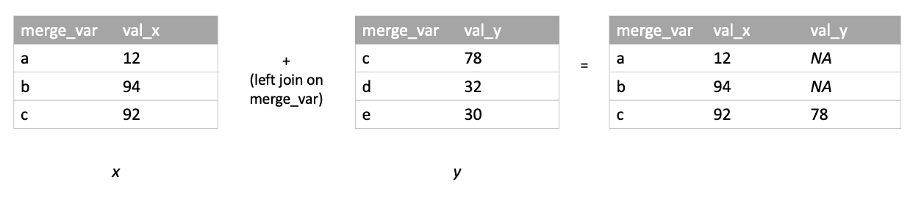
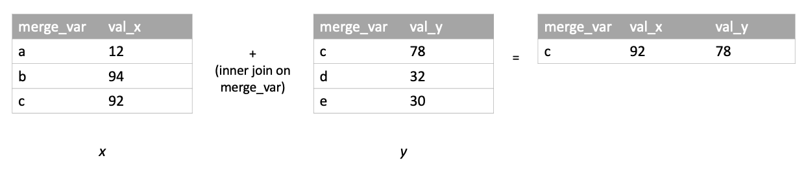
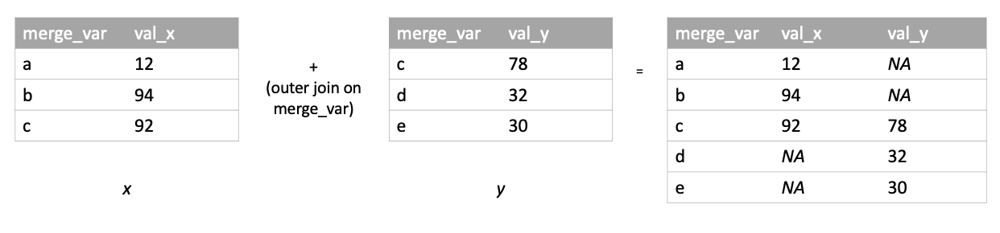

# Combine, Reshape and Merge

```{r,echo=FALSE}
knitr::opts_chunk$set(comment = '##', prompt = FALSE, collapse = FALSE)
```

This chapter looks at various strategies for combining, reshaping, and merging data.

## Combine rows

Combining rows can be thought of as "stacking" rectangular data structures.

#### Python {-}

The pandas function `concat()` binds rows together. It takes a list of pandas DataFrame objects. The second argument, `axis`, specifies a row bind when set to `0` and a column bind when set to `1`. The default value is `0`. The column names of the DataFrames should match; otherwise, the DataFrame fills with `NaN`s. You can bind rows with different column types.

```{python}
import pandas as pd

d1 = pd.DataFrame({'x':[4, 5, 6], 'y':['a', 'b', 'c']})
d2 = pd.DataFrame({'x':[3, 2, 1], 'y':['d', 'e', 'f']})

# Create list of DataFrame objects
frames = [d1, d2]
combined_df = pd.concat(frames)

combined_df
```

The following code is an example of when column names do not match, resulting in `NaN`s in the DataFrame.

```{python}
# DataFrame with different column names
d1 = pd.DataFrame({'x':[4,5,6], 'z':['a','b','c']})
d2 = pd.DataFrame({'x':[3,2,1], 'y':['d','e','f']})

# Create list of DataFrame objects
frames = [d1, d2]
combined_df = pd.concat(frames)

combined_df
```

#### R {-}

As its name suggets, the `rbind()` function binds rows. It takes two or more objects as arguments. To row bind data frames, the column names must match, otherwise an error is returned. If the columns being stacked in the row bind have differing variable types, the values will be coerced according to the followig hierarchy: `logical` < `integer` < `double` < `complex` < `character`. (E.g., if you stack a set of rows with type `logical` in column _J_ on a set of rows with type `character` in column _J_, the output will have column _J_ as type `character`.)

```{r}
d1 <- data.frame(x = 4:6, y = letters[1:3])
d2 <- data.frame(x = 3:1, y = letters[4:6])
rbind(d1, d2)
```

See also the `bind_rows()` function in the **dplyr** package.

## Combine columns

Combining columns can be thought of as setting rectangular data structures next to each other.

#### Python {-}

The `concat()` function can be used to bind columns. Whereas we set `axis` to `0` above in order to bind rows, we set `axis` to `1` in order to bind columns. To column bind data frames, the number of rows must match; otherwise, the function throws an error.

```{python}
d1 = pd.DataFrame({'x':[4, 5, 6], 'y':['a', 'b', 'c']})
d2 = pd.DataFrame({'z':[3, 2, 1], 'a':['d', 'e', 'f']})

# Create list of DataFrame objects
frames = [d1, d2]
combined_df = pd.concat(frames, axis=1)

combined_df
```

#### R {-}

The `cbind()` function binds columns. It takes two or more objects as arguments. To column bind data frames, the number of rows must match; otherwise, the object with fewer rows will have rows "recycled" (if possible) or an error will be returned.

```{r}
d1 <- data.frame(x = 10:13, y = letters[1:4])
d2 <- data.frame(x = c(23, 34, 45, 44))
cbind(d1, d2)
```

```{r}
# Example of recycled rows (d1 is repeated twice)
d1 <- data.frame(x = 10:13, y = letters[1:4])
d2 <- data.frame(x = c(23, 34, 45, 44, 99, 99, 99, 99))
cbind(d1, d2)
```

See also the `bind_cols()` function in the **dplyr** package.

## Reshaping data

The next two sections discuss how to reshape data from wide to long and from long to wide. "Wide" data are structured such that multiple values associated with a given unit (e.g., a person, a cell culture, etc.) are placed in the same row:
  
```{r, echo = F}
temp <- data.frame(name = c('larry', 'moe', 'curly'), time_1_score = c(3, 6, 2), time_2_score = c(0, 3, 1))
temp
```

_Long_ data, conversely, are structured such that all values are contained in one column, with another column identifying what value is given in any particular row ("time 1," "time 2," etc.):

```{r, echo = F}
temp <- data.frame(id = rep(c('larry', 'moe', 'curly'), each = 2), time = rep(1:2, times = 3), score = c(3, 0, 6, 3, 2, 1))
temp
```

Shifting between these two data formats is often necessary for implementing certain statistical techniques or representing data with particular visualizations.

### Wide to long

#### Python {-}

To reshape a DataFrame from wide to long, we can use the pandas `melt()` function.

Consider the wide DataFrame below:

```{python}
import numpy as np
import pandas as pd

data = {"id": [1, 2, 3],
        "wk1": np.random.choice(range(20), 3),
        "wk2": np.random.choice(range(20), 3),
        "wk3": np.random.choice(range(20), 3)}

df_wide = pd.DataFrame(data)
print(df_wide)
```

To take the DataFrame from wide to long with `melt()`, we specify the column(s) that uniquely identifies each row (`id_vars`), the variables containing the values to be lengthened (`value_vars`), and the name of the to-be-created column containing the lengthened values (`value_name`).

```{python}
dataL = pd.melt(df_wide,
                # Column(s) that uniquely identifies/y each row
                id_vars = ["id"],
                # Variables that contain the values to be lengthened
                value_vars = ["wk1", "wk2", "wk3"],
                # Desired name of column in long data that will contain values
                value_name = "observations")
print(dataL)
```

#### R {-}

In base R, the `reshape()` function can take data from wide to long or long to wide. The **tidyverse** also provides reshaping functions: `pivot_longer()` and `pivot_wider()`. The **tidyverse** functions have a degree of intuitiveness and usability that may make them the go-to reshaping tools for many R users. We give examples below using both base R and **tidyverse**.

Say we begin with a wide data frame, `df_wide`, that looks like this:
```{r, echo = F}
set.seed(10)
df_wide <- data.frame(id = rep(1:3),
                      sex = sample(c('m', 'f'), 3, replace = T),
                      wk1 = sample(1:20, 3, replace = T),
                      wk2 = sample(1:20, 3, replace = T),
                      wk3 = sample(1:20, 3, replace = T))
df_wide
```

To lengthen a data frame using `reshape()`, a user provides arguments specifying the columns that identify values' origins (person, cell culture, etc.), the columns containing values to be lengthened, and the desired names for new columns in long data:

```{r}
df_long <- reshape(df_wide,
                   direction = 'long',
                   # Column(s) that uniquely identifies/y each row
                   idvar = c('id', 'sex'), 
                   # Variables that contain the values to be lengthened
                   varying = c('wk1', 'wk2', 'wk3'),
                   # Desired name of column in long data that will contain values
                   v.names = 'val',
                   # Desired name of column in long data that will identify each value's context
                   timevar = 'week')
df_long
```

The **tidyverse** function for taking data from wide to long is `pivot_longer()`. To lengthen `df_wide` using `pivot_longer()`, a user would write:
  
```{r, message = F}
library(tidyverse)
df_long_PL <- pivot_longer(df_wide,
                           # Columns that contain the values to be lengthened (can use -c() to negate variables)
                           cols = -c('id', 'sex'), 
                           # Desired name of column in long data that will identify each value's context
                           names_to = 'week',
                           # Desired name of column in long data that will contain values
                           values_to = 'val') 
df_long_PL
```

`pivot_longer()` is particularly useful (a) when dealing with wide data that contain multiple sets of repeated measures in each row that need to be lengthened separately (e.g., two monthly height measurements and two monthly weight measurements for each person) and (b) when column names and/or column values in the long data need to be extracted from column names of the wide data using regular expressions.

For example, say we begin with a wide data frame, `animals_wide`, in which every row contains two values for each of two different measures:

```{r, echo = F}
library(tidyverse)
animals_wide <- data.frame(animal = c('dolphin', 'porcupine', 'capybara'),
                           lives_in_water = c(T, F, F),
                           jan_playfulness = c(6, 3.5, 4.0),
                           feb_playfulness = c(5.5, 4.5, 5.0),
                           jan_excitement = c(7.0, 3.5, 4.0),
                           feb_excitement = c(7.0, 3.5, 4.0))
animals_wide
```

`pivot_longer()` can be used to convert this data frame to a long format where there is one column for each of the measures, playfulness and excitement:

```{r}
animals_long_1 <- pivot_longer(animals_wide,
                             cols = -c('animal', 'lives_in_water'),
                             # ".value" is placeholder for strings that will be extracted from wide column names 
                             names_to = c('month', '.value'),
                             # Specify structure of wide column names from which long column names will be extracted using regex
                             names_pattern = '(.+)_(.+)') 
animals_long_1
```

Alternatively, `pivot_longer()` can be used to convert this data frame to a long format where there is one column containing all the playfulness and excitement values:

```{r}
animals_long_2 <- pivot_longer(animals_wide,
                               cols = -c('animal', 'lives_in_water'),
                               names_to = c('month', 'measure'),
                               names_pattern = '(.+)_(.+)',
                               values_to = 'val')
animals_long_2
```

### Long to wide

#### Python {-}

To reshape a DataFrame from long to wide, we can use the pandas `pivot_table()` function.

Consider the following long DataFrame:

```{python}
import numpy as np
import pandas as pd

data = {"id": np.concatenate([([i]*3) for i in [1, 2 ,3]], axis=0),
        "week": [1, 2, 3] * 3,
        "observations": np.random.choice(range(20), 9)}

df_long = pd.DataFrame(data)
print(df_long)
```

We can use `pivot_table()` to take the DataFrame from long to wide by specifying: the variable(s) that indicates each value's source (`index`), the variable that indicates the context of each value (`columns`; e.g., "week 1," "week 2," etc.), and the variable containing the values to be widened (`values`).

```{python}
df_wide = pd.pivot_table(df_long,
          index = 'id',
          columns = 'week',
          values = 'observations')
print(df_wide)
```

#### R {-}

Say that we begin with a long data frame, `df_long`, that looks like this:

```{r}
df_long
```

To take the data from long to wide with base R's `reshape()` function, a user would write:

```{r}
df_wide <- reshape(df_long,
                   direction = 'wide',
                   # Column(s) that determine which rows should be grouped together in the wide data
                   idvar = c('id', 'sex'),
                    # Column containing values to widen
                   v.names = 'val',
                   # Column from which resulting wide column names are pulled
                   timevar = 'week',
                   # The `sep` argument allows a user to specify how the contents of `timevar` should be joined with the name of the `v.names` variable to form wide column names
                   sep = '_')
df_wide
```

The **tidyverse** function for taking data from long to wide is `pivot_wider()`. To widen `df_long` using `pivot_longer()`, a user would write:

```{r}
library(tidyverse)
df_wide_PW <- pivot_wider(df_long,
                          id_cols = c('id', 'sex'),
                          values_from = 'val',
                          names_from = 'week',
                          names_prefix = 'week_') # `names_prefix` specifies a string to paste in front of the contents of 'week' in the resulting wide column names
df_wide_PW
```

`pivot_wider()` provides a great deal of functonality when widening relatively complicated long data structures. For example, say we want to widen both of the long versions of the "animals" data frame created above.

To widen the version of the long data that has a column for each of the measures (playfulness and excitement):

```{r}
animals_long_1
animals_wide <- pivot_wider(animals_long_1,
                            id_cols = c('animal', 
                                        'lives_in_water'),
                            values_from = c('playfulness',
                                            'excitement'),
                            names_from = 'month',
                            names_glue = '{month}_{.value}') # `names_glue` allows for customization of column names using "glue"; see https://glue.tidyverse.org/
animals_wide
```

To widen the version of the long data that has one column containing all the values of playfulness and excitement together:

```{r}
animals_long_2
animals_wide <- pivot_wider(animals_long_2,
                            id_cols = c('animal', 'lives_in_water'),
                            values_from = 'val',
                            names_from = c('month', 'measure'),
                            names_sep = '_')
animals_wide
```

## Merge/Join

The merge/join examples below all make use of the following sample data frames:
```{r, echo = F}
# initialize join data
x <- data.frame(merge_var = c('a', 'b', 'c'), val_x = c(12, 94, 92))
y <- data.frame(merge_var = c('c', 'd', 'e'), val_y = c(78, 32, 30))
```
```{python, echo = F}
x = r.x
y = r.y
```
```{r}
x
y
```

### Left Join

A left join of _x_ and _y_ keeps all rows of _x_ and merges rows of _y_ into _x_ where possible based on the merge criterion:

```{r, echo = F}

```

#### Python {-}
```{python}
import pandas as pd
pd.merge(x, y, how = 'left')
```
#### R {-}
```{r}
# all.x = T results in a left join
merge(x, y, by = 'merge_var', all.x = T)
```

### Right Join

A right join of _x_ and _y_ keeps all rows of _y_ and merges rows of _x_ into _y_ wherever possible based on the merge criterion:

```{r, echo = F}

```

#### Python {-}
```{python}
import pandas as pd
pd.merge(x, y, how = 'right')
```
#### R {-}
```{r}
# all.y = T results in a right join
merge(x, y, by = 'merge_var', all.y = T)
```

### Inner Join

An inner join of _x_ and _y_ returns merged rows for which a match can be found on the merge criterion _in both tables_:

```{r, echo = F}

```

#### Python {-}

```{python}
import pandas as pd
pd.merge(x, y, how = 'inner')
```

#### R {-}

```{r}
# with its default arguments, merge() executes an inner join
# (more specifically, a natural join, which is a kind of
# inner join in which the merge-criterion column is not
# repeated, despite being initially present in both tables)
merge(x, y, by = 'merge_var')
```

### Outer Join

An outer join of _x_ and _y_ keeps all rows from both tables, merging rows wherever possible based on the merge criterion:

```{r, echo = F}

```

#### Python {-}

```{python}
import pandas as pd
pd.merge(x, y, how = 'outer')
```

#### R {-}

```{r}
# all = T (or all.x = T AND all.y = T) results in an outer join
merge(x, y, by = 'merge_var', all = T)
```