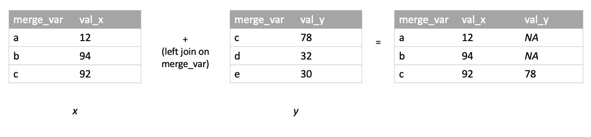

--- 
title: "Python and R"
author: "Clay Ford, Jacob Goldstein-Greenwood, Oyinkansola Adenekan, Samantha Lomuscio"
date: "`r Sys.Date()`"
site: bookdown::bookdown_site
documentclass: book
bibliography: ["book.bib", "packages.bib"]
# url: your book url like https://bookdown.org/yihui/bookdown
# cover-image: path to the social sharing image like images/cover.jpg
description: "This book provides parallel examples in Python and R to help users of one platform more easily transition to the other."
link-citations: yes
github-repo: uvastatlab/Python_and_R
nocite: |
  @*
---

# Welcome {-}

This book provides parallel examples in Python and R to help users of one platform more easily learn how the other platform "works" when it comes to data analysis.

```{r echo = F, eval = F}
# To activate [a conda] environment, use
#
#     $ conda activate r-reticulate
#
# To deactivate an active environment, use
#
#     $ conda deactivate
```


<!--chapter:end:index.Rmd-->

# Basics 

```{r,echo=FALSE}
knitr::opts_chunk$set(comment = NA, prompt = TRUE, collapse = TRUE)
```

This chapter covers the very basics of Python and R.

## Math

Mathematical operators are the same except for exponents, integer division, and remainder division (modulo).

#### Python {-}

Python uses `**` for exponentiation, `//` for integer division, and `%` for remainder division.

```{python}
3**2
5 // 2
5 % 2
```

In Python, the `+` operator can also be used to combine strings. See this TBD section.

#### R {-}

Python uses `^` for exponentiation, `%/%` for integer division, and `%%` for remainder division.

```{r}
3^2
5 %/% 2
5 %% 2
```

## Assignment

Python uses `=` for assignment while R can use either `=` or `<-` for assignment. The latter "assignment arrow" is preferred in most R style guides to distinguish it between assignment and setting the value of a function argument. According to R's documentation, "The operator `<-` can be used anywhere, whereas the operator `=` is only allowed at the top level (e.g., in the complete expression typed at the command prompt) or as one of the subexpressions in a braced list of expressions." See `?assignOps`.

#### Python {-}

```{python}
x = 12
```

#### R {-}

```{r}
x <- 12
```

## Printing a value

To see the value of an object created via assignment, you can simply enter the object at the console and hit enter for both Python and R, though it is common in Python to explicitly use the `print()` function.

#### Python {-}

```{python}
x
```

#### R {-}

```{r}
x
```

## Packages

User-created functions can be bundled and distributed as packages. Packages need to be installed only once. Thereafter they're "imported" (Python) or "loaded" (R) in each new session when needed.

Packages with large user bases are often updated to add functionality and fix bugs. The updates are not automatically installed. Staying apprised of library/package updates can be challenging. Some suggestions are following developers on Twitter, signing up for newsletters, or periodically checking to see what updates are available.

Packages often depend on other packages. These are known as "dependencies." Sometimes packages are updated to accommodate changes to other packages they depend on.

#### Python {-}

#### R {-}

The main repository for R packages is the [Comprehensive R Archive Network](https://cran.r-project.org/) (CRAN). Another repository is [Bioconductor](https://www.bioconductor.org/), which provides tools for working with genomic data. Many packages are also distributed on [GitHub](https://github.com/).

To install packages from CRAN use the `install.packages()` function. In RStudio, you can also go to Tools...Install Packages... for a dialog that will auto-complete package names as you type.

```{r eval=FALSE}
# install the vcd package, a package for Visualizing Categorical Data
install.packages("vcd")

# load the package
library(vcd)

# see which packages on your computer have updates available
old.packages()

# download and install available package updates;
# set ask = TRUE to verify installation of each package
update.packages(ask = FALSE)
```

To install R packages from GitHub use the `install_github()` function from the **devtools** package. You need to include the username of the repo owner followed by a forward slash and the name of the package. Typing two colons between a package and a function in the package allows you to use that function without loading the package. That's how we use the `install_github()` below.

```{r eval=FALSE}
install.packages("devtools")
devtools::install_github("username/packagename")
```

Occasionally when installing package updates you will be asked "Do you want to install from sources the package which needs compilation?" R packages on CRAN are _compiled_ for Mac and Windows operating systems. That can take a day or two after a package has been submitted to CRAN. If you try to install a package that has not been compiled then you'll get asked the question above. If you click _Yes_, R will try to compile the package on your computer. This will only work if you have the required build tools on your computer. For Windows this means having [Rtools](https://cran.r-project.org/bin/windows/Rtools/) installed. Mac users should already have the necessary build tools. Unless you absolutely need the latest version of a package, it's probably fine to click _No_.

## Logic

Python and R share the same operators for making comparisons: 

- `==` (equals)
- `!=` (not equal to)
- `<` (less than)
- `<=` (less than or equal to)
- `>` (greater than)
- `>=` (greater than or equal to)

Likewise they share the same operators for logical AND and OR:

- `&` (AND)
- `|` (OR)

However R also has `&&` and `||` operators for programming control-flow.

Python and R have different operators for negation and xor (exclusive OR). 

#### Python {-}

#### R {-}

## Generating a sequence of values

In Python, one option for generating a sequence of values is `arange()` from **NumPy**. In R, a common approach is to use `seq()`. The sequences can be incremented by indicating a `step` argument in `arange()` or a `by` argument in `seq()`. Be aware that the end of the start/stop interval in `arange()` is _open_, but both sides of the from/to interval in `seq()` are _closed_.

#### Python {-}

```{python}
import numpy as np
x = np.arange(start = 1, stop = 11, step = 2)
x
```

#### R {-}

```{r}
x <- seq(from = 1, to = 11, by = 2)
x
```

## Calculating means and medians

The **NumPy** Python library has functions for calculating means and medians, and base R has functions for doing the same.

#### Python {-}

Mean, using function from **NumPy** library

```{python}
import numpy as np
x = [90, 105, 110]
x_avg = np.mean(x)
print(x_avg)
```

Median, using function from **NumPy** library

```{python}
x = [98, 102, 20, 22, 304]
x_med = np.median(x)
print(x_med)
```

#### R {-}

Mean, using function from base R

```{r}
x <- c(90, 105, 110)
x_avg <- mean(x)
x_avg
```

Median, using function from base R

```{r}
x <- c(98, 102, 20, 22, 304)
x_med <- median(x)
x_med
```

## Writing your own functions


#### Python {-}

#### R {-}

<!--chapter:end:01-basics.Rmd-->

# Data Structures 

```{r,echo=FALSE}
knitr::opts_chunk$set(comment = NA, prompt = TRUE, collapse = TRUE)
```

This chapter compares and contrasts data structures in Python and R.

## One-dimensional data

A one-dimensional data structure can be visualized as a column in a spreadsheet or as a list of values. 

#### Python {-}

There are many ways to organize one-dimensional data in Python. The of the most common one-dimensional data structures are lists, numpy arrays, and pandas Series. All three are ordered and mutable, and can contain data of different types. 

Lists in Python do not need to be explicitly declared, they are indicated by the use of square brackets.

```{python}
l = [1,2,3,'hello']
```

Values in lists can be accessed by using square brackets. Python indexing begins at 0, so to extract the first element, we would use the index 0. Python also allows for negative indexing, using an index of -1 will return the last value in the list. Indexing a range in Python is not inclusive of the last index. 

```{python}
# extract first element
l[0]

#extract last element
l[-1]

# extract 2nd and 3rd elements
l[1:3]

```

Numpy arrays, on the other hand, need to be declared using the `numpy.array()` function and the `numpy` package needs to be imported. 

```{python}
import numpy as np

arr = np.array([1,2,3,'hello'])
print(arr)
```

Accessing data in a numpy array is the same as indexing a list. 

```{python}
# extract first element 
arr[0]

# extract last element
arr[-1]

# extract 2nd and 3rd elements
arr[1:3]
```

Pandas Series also need to be declared using the `pandas.Series()` function. Like `numpy`, the `pandas`package must be imported as well. The pandas package is built on numpy, so we can input data into a pandas Series using a numpy array. We can extract data from the Series by using the index similar to indexing a list and numpy array.

```{python}
import pandas as pd 
import numpy as np

data = np.array([1,2,3,"hello"])
ser1 = pd.Series(data)
print(ser1)

# extract first element 
ser1[0]

# extract last element 
ser1[-1]

# extract 2nd and 3rd elements 
ser1[1:3]
```

We can relabel the indices of the Series to whatever we like using the `index` attribute within the `Series` function. 

```{python}
import pandas as pd 
import numpy as np

ser2 = pd.Series(data, index=['a','b','c','d'])
print(ser2)
```

We can then use our own specified indices to select and index our data. Indexing with our labels can be done in two ways. One similar to indexing arrays and lists with square brackets using the `.loc` function, and the other follows this form: `Series.label_name`.

```{python}

# extract element in row b
ser2.loc["b"]

# extract elements from row b to the end
ser2.loc["b":]

# extract element in row "d"
ser2.d

# extract element in row "b"
ser2.b
```

One thing to note is that mathematical operations cannot be carried out on lists, but can be carried out on numpy arrays and pandas Series. In general, lists are better for short data sets that you will not be operating on mathematically. Numpy arrays and pandas Series are better for long data sets, and for data sets that will be operated on mathematically. 

#### R {-}

In R a one-dimensional data structure is called a _vector_. We can create a vector using the `c()` function. A vector in R can only contain one type of data (all numbers, all strings, etc). The columns of data frames are vectors. If multiple types of data are put into a vector, the data will be coerced according to the hierarchy `logical` < `integer` < `double` < `complex` < `character`. This means if you mix, say, integers and character data, all the data will be coerced to character. 

```{r}
x1 <- c(23, 43, 55)
x1

# all values coerced to character
x2 <- c(23, 43, 'hi')
x2
```

Values in a vector can be accessed by position using indexing brackets. 

```{r}
# extract the 2nd value
x1[2]

# extract the 2nd and 3rd value
x1[2:3]

```


## Two-dimensional data

Two-dimensional data are rectangular in nature, consisting of rows and columns. These can be the type of data you might find in a spreadsheet with a mix of data types in columns; they can also be matrices as you might encounter in matrix algebra.

#### Python {-}
In Python, two common two-dimensional data structures include the _numpy array_ and the _pandas DataFrame_. 

A two-dimensional numpy array is made in a similar way to the one-dimensional array using the `numpy.array` function. 

```{python}
import numpy as np

arr2d = np.array([[1,2,3,"hello"],[4,5,6,"world"]])
print(arr2d)
```

Selecting data for a two-dimensional numpy array follows the same form as indexing a one-dimensional array. 

```{python}
import numpy as np

# extract first element 
arr2d[0,0]

# extract last element 
arr2d[-1, -1]

# extract 2nd and 3rd columns
arr2d[:,1:3]

```

A pandas DataFrame is made using the `pandas.DataFrame` function in a similar way to the pandas Series. 

```{python}
import pandas as pd
import numpy as np

data = np.array([[1,2,3,"hello"],[4,5,6,"world"]])
df = pd.DataFrame(data)
print(df)
```

Selecting data from a DataFrame is similar to that of the Series. 

```{python}
# extract first element 
df.loc[0,0]

# extract column 1
df.loc[0]

# extract row 1
df.loc[0,0]
```

Like the pandas Series, we can change the indices and the column names of the DataFrame and can use those to select and index our data. 

We change the indices again using the `index` attribute in the `pandas.DataFrame` function:

```{python}
import pandas as pd
import numpy as np

data = np.array([[1,2,3,"hello"],[4,5,6,"world"]])
df = pd.DataFrame(data, index=["a","b"])
print(df)
```

We can change the column names using the `columns` attribute in the `pandas.DataFrame` function:

```{python}
import pandas as pd
import numpy as np

data = np.array([[1,2,3,"hello"],[4,5,6,"world"]])
df = pd.DataFrame(data, index=["a","b"], columns=["column 1","column 2", "column 3", "column 4"])
print(df)
```

One thing to note is that numpy arrays can actually have N dimensions, whereas pandas DataFrames can only have two. Numpy arrays will be the better choice for data with more than two dimensions. 

#### R {-}

Two-dimensional data structures in R include the _matrix_ and _data frame_. A matrix can contain only one data type. A data frame can contain multiple vectors each of which can consist of different data types. 

Create a matrix with the `matrix()` function. Create a data frame with the `data.frame()` function. Most imported data comes into R as a data frame.

```{r}
# matrix; populated down by column by default
m <- matrix(data = c(1,3,5,7), nrow = 2, ncol = 2)
m

# data frame
d <- data.frame(name = c("Rob", "Cindy"),
                age = c(35, 37))
d
```

Values in a matrix and data frame can be accessed by position using indexing brackets. The first number(s) refers to rows; the second number(s) refers to columns. Leaving row or column numbers empty selects all rows or columns.

```{r}
# extract value in row 1, column 2
m[1,2]

# extract values in row 2
d[2,]
```


## Three-dimensional and higher data

Three-dimensional and higher data can be visualized as multiple rectangular structures stratified by extra variables. These are sometimes referred to as _arrays_. Analysts usually prefer two-dimensional data frames to arrays. Data frames can accommodate multidimensional data by including the additional dimensions as variables.

#### Python {-}


#### R {-}

The `array()` function in R can create three-dimensional and higher data structures. Specify the dimension number and size using the `dim` argument. Below we specify 2 rows, 3 columns, and 2 strata using a vector: `c(2,3,2)`. This creates a three-dimensional data structure. The data are simply the numbers 1 through 12.

```{r}
a1 <- array(data = 1:12, dim = c(2,3,2))
a1
```

Values in arrays can be accessed by position using indexing brackets.

```{r}
# extract value in row 1, column 2, strata 1
a1[1,2,1]

# extract column 2 in both strata
# result is returned as matrix
a1[,2,]
```

The dimensions can be named using the `dimnames()` function. Notice the names must be a _list_.

```{r}
dimnames(a1) <- list("X" = c("x1", "x2"), 
                     "Y" = c("y1", "y2", "y3"), 
                     "Z" = c("z1", "z2"))
a1
```

The `as.data.frame.table()` function can collapse an array into a two-dimensional structure that may be easier to use with standard statistical and graphical routines. The `responseName` argument allows you to provide a suitable column name for the values in the array.

```{r}
as.data.frame.table(a1, responseName = "value")
```


<!--chapter:end:02-data-structures.Rmd-->

# Importing Data 

```{r,echo=FALSE}
knitr::opts_chunk$set(comment = NA, prompt = TRUE, collapse = TRUE)
```

This chapter reviews importing external data into Python and R, including CSV, Excel, and other structured data files. There is often more than one way to import data into Python and R. The examples below highlight one way that we frequently see used.

The data we use for demonstration is New York State Math Test Results by Grade from 2006 - 2011, downloaded from [data.gov](https://catalog.data.gov/dataset/2006-2011-nys-math-test-results-by-grade-citywide-by-race-ethnicity) on September 30, 2021.

## CSV

Comma separated value (CSV) files are text files with fields separated by commas. They are useful for "rectangular" data where rows represent observations and columns represent variables or features. 

#### Python {-}

The **pandas** function `read_csv()` is a common approach to importing CSV files into Python.

```{python}
import pandas as pd
d = pd.read_csv('data/ny_math_test.csv')
d.loc[0:2, ["Grade", "Year", "Mean Scale Score"]]
```


#### R {-}

There are many ways to import a csv file. A common way is to use the base R function `read.csv()`.

```{r}
d <- read.csv("data/ny_math_test.csv")
d[1:3, c("Grade", "Year", "Mean.Scale.Score")]
```

Notice the spaces in the column names have been replaced with periods. 

Two packages that provide alternatives to `read.csv()` are **readr** and **data.table**. The **readr** function `read_csv()` returns a [tibble](https://r4ds.had.co.nz/tibbles.html). The **data.table** function `fread()` returns a [data.table](https://rdatatable.gitlab.io/data.table/articles/datatable-intro.html). 


## XLS/XLSX (Excel)

Excel files are native to Microsoft Excel. Prior to 2007, Excel files had an extension of XLS. With the launch of Excel 2007, the extension was changed to XLSX. Excel files can have multiple sheets of data. This needs to be accounted for when importing into Python and R.


#### Python {-}

The **pandas** function `read_excel()` is a common approach to importing Excel files into Python. The `sheet_name` argument allows you to specify which sheet you want to import. You can specify sheet by its (zero-indexed) ordering or by its name. Since this Excel file only has one sheet we do not need to use the argument. In addition, specifying `sheet_name=None` will read in all sheets and return a dict data structure where the _key_ is the sheet name and the _value_ is a DataFrame.

```{python, eval = F}
import pandas as pd  
d = pd.read_excel('data/ny_math_test.xlsx')  
d.loc[0:2, ["Grade", "Year", "Mean Scale Score"]]  

```


#### R {-}

**readxl** is a well-documented and actively maintained package for importing Excel files into R. The workhorse function is `read_excel()`. The `sheet` argument allows you to specify which sheet you want to import. You can specify sheet by its ordering or by its name. Since this Excel file only has one sheet we do not need to use the argument.

```{r}
library(readxl)
d_xls <- read_excel("data/ny_math_test.xlsx")
d_xls[1:3, c("Grade", "Year", "Mean Scale Score")]
```

The result is a _tibble_, a [tidyverse data frame](https://tibble.tidyverse.org/). 

It's worth noting we can use the `range` argument to specify a range of cells to import. For example, if the top left corner of the data was B5 and the bottom right corner of the data was J54, we could enter `range="B5:J54"` to just import that section of data.

## JSON

JSON (**J**ava**S**cript **O**bject **N**otation) is a flexible format for storing data. JSON files are text and can be viewed in any text editor. Because of their flexibility JSON files can be quite complex in the way they store data. Therefore there is no one-size-fits-all method for importing JSON files into Python or R.


#### Python {-}

Below is one approach to importing our "ny_math_test.json" example file. We first import Python's built-in **json** package and use its `loads()` function to read in the lines of the json file. The file is accessed using the `open` function and its associated `read` method. 

Next we use the **pandas** function `json_normalize()` to convert the 'data' structure of the json data into a DataFrame.

Finally we add column names to the DataFrame.

```{python}
import json
# load data using Python JSON module
with open('data/ny_math_test.json','r') as f:
    data = json.loads(f.read())

import pandas as pd  
d_json = pd.json_normalize(data, record_path =['data'])

# add column names
names = list()
for i in range(23): 
  names.append(data['meta']['view']['columns'][i]['name'])
d_json.columns = names

d_json.loc[0:2, ["Grade", "Year", "Mean Scale Score"]]  
```

Again, this is just one approach that assumes we want a DataFrame. 

#### R {-}

**jsonlite** is one of several R packages available for importing JSON files into R. The `read_json()` function takes a JSON file and returns a list or data frame depending on the structure of the data file and its arguments. We set `simplifyVector = TRUE` so the data is simplified into a matrix.

```{r}
library(jsonlite)
d_json <- read_json('data/ny_math_test.json', simplifyVector = TRUE)
```

The `d_json` object is a list with two elements: "meta" and "data". The "data" element is a matrix that contains the data of interest. The "meta" element contains the column names for the data (among much else). Notice we had to "drill down" in the list to find the column names. We assign column names to the matrix using the `colnames()` function and then convert the matrix to a data frame using the `as.data.frame()` function.  

```{r}
colnames(d_json$data) <- d_json$meta$view$columns$fieldName
d_json <- as.data.frame(d_json$data)
d_json[1:3,c("grade", "year", "mean_scale_score")]
```


## XML

XML (e**X**tensible **M**arkup **L**anguage) is a markup language that was designed to store data. XML files are text and can be viewed in any text editor or a web browser. Because of their flexibility XML files can be quite complex in the way they store data. Therefore there is no one-size-fits-all for importing XML files into Python or R.


#### Python {-}

The **pandas** library provides the `read_xml` function for importing XML files. The `ny_math_test.xml` file identifies records with nodes named "row". The 168 rows are nested in one node also called "row". Therefore we use the `xpath` argument to specify that we want to elect all row elements that are descendant of the single row element.

```{python}
import pandas as pd
d_xml = pd.read_xml('data/ny_math_test.xml', xpath="row//row")

d_xml.loc[0:2, ["grade", "year", "mean_scale_score"]]  
```


#### R {-}

**xml2** is a relatively small but powerful package for importing and working with XML files. The `read_xml()` function imports an XML file and returns a list of _pointers_ to XML _nodes_. There are a number of ways to proceed once you import an XML file, such as using the `xml_find_all()` function to find nodes that match an [xpath](https://www.w3schools.com/xml/xpath_intro.asp) expression. Below we take a simple approach and convert the XML nodes into a list using the `as_list()` function that is part of the **xml2** package. Once we have the XML nodes in a list, we can use the `bind_rows()` function in the **dplyr** package to create a data frame. Notice we have to drill down into the list to select the element that contains the data. After this we need to do one more thing: _unlist_ each the columns into vectors. We do this by applying the `unlist` function to each column of `d`. We save the result by assigning to `d[]`, which overwrites each element (or column) of `d` with the unlisted result. 

```{r}
library(xml2)
d_xml <- read_xml('data/ny_math_test.xml')
d_list <- as_list(d_xml)
d <- dplyr::bind_rows(d_list$response$row)
d[] <- lapply(d, unlist)
d[1:3,c("grade", "year", "mean_scale_score")]
```

The result is a _tibble_, a [tidyverse data frame](https://tibble.tidyverse.org/). We would most likely want to proceed to converting certain columns to numeric. 


<!--chapter:end:03-import.Rmd-->

# Data Manipulation

```{r,echo=FALSE}
knitr::opts_chunk$set(comment = NA, prompt = TRUE, collapse = TRUE)
```

This chapter looks at various strategies for modifying and deriving variables in data. Unless otherwise stated, examples are for DataFrames (Python) and data frames (R) and use the mtcars data frame that is included with R.

```{python}
# Python
import pandas
mtcars = pandas.read_csv('data/mtcars.csv')
```


```{r}
# R
data(mtcars)
# drop row names to match Python version of data
rownames(mtcars) <- NULL
```


## Names of variables and their types

View and inspect the names of variables and their type (numeric, string, logical, etc.) This is useful to ensure that variables have the expected type. 

#### Python {-}

The `.info()` function in pandas lists information on the DataFrame.


Setting the argument `verbose` to `True` prints the name of the columns, their length excluding `NULL` values, and their data type (`dtype`) in a table. The function lists the unique data types in the DataFrame, and it prints how much memory the DataFrame takes up.

```{python}
mtcars.info(verbose=True)
```

By default, the `verbose` argument is set to `False`. Then, the function lists the unique data types in the DataFrame, and it prints how much memory the DataFrame takes up. This setting excludes the table describing each column.

```{python}
mtcars.info()
```


#### R {-}

The `str()` function in R lists the names of the variables, their type, the first few values, and the dimensions of the data frame.  

```{r}
str(mtcars)
```

To see just the names of the data frame, use the `names()` function.

```{r}
names(mtcars)
```

To see just the dimensions of the data frame, use the `dim()` function. It returns the number of rows and columns, respectively.


```{r}
dim(mtcars)
```

## Access variables

How to work with a specific column of data.

#### Python {-}
The period operator `.` provides access to a column in a DataFrame as a vector. This returns pandas series. A pandas series can do everything a numpy array can do.

```{python}
mtcars.mpg
```

Indexing also provides access to columns as a pandas Series. Single and double quotations both work.

```{python}
mtcars['mpg']
```

Operations on numpy arrays are faster than operations on pandas series. But using pandas series should be fine, in terms of performance, in many cases. This is important for large data sets on which many operations are performed. The `.values` function returns a numpy array.

```{python}
mtcars['mpg'].values
```

Double indexing returns a pandas DataFrame, instead of a numpy array or pandas series.

```{python}
mtcars[['mpg']]
```

The `head()` and `tail()` functions return the first 5 or last 5 values. Use the `n` argument to change the number of values. This function works on numpy array, pandas series and pandas DataFrames.

```{python}
# first 6 values
mtcars.mpg.head()
```

```{python}
# last row of DataFrame
mtcars.tail(n=1)
```

#### R {-}

The dollar sign operator, `$`, provides access to a column in a data frame as a vector.

```{r}
mtcars$mpg
```

Double indexing brackets also provide access to columns as a vector.

```{r}
mtcars[["mpg"]]
```

Single indexing brackets work as well, but return a data frame instead of a vector (if used with a data frame).

```{r}
mtcars["mpg"]
```


Single indexing brackets also allow selection of rows when used with a comma. The syntax is `rows, columns`

```{r}
# first three rows
mtcars[1:3, "mpg"]
```

Finally single indexing brackets allow us to select multiple columns. Request columns either by name or position using a vector.

```{r}
mtcars[c("mpg", "cyl")] 
# same as mtcars[1:2] 
```

The `head()` and `tail()` functions return the first 6 or last 6 values. Use the `n` argument to change the number of values. They work with vectors or data frames.

```{r}
# first 6 values
head(mtcars$mpg)
```

```{r}
# last row of data frame
tail(mtcars, n = 1)
```


## Rename variables

How to rename variables or "column headers".

#### Python {-}

Column names can be chnaged using the function `.rename()`. Below, we change the column names "cyl" and "wt" to "cylinder" and "WT", respectively.

```{python}
mtcars.rename(columns={"cyl":"cylinder", "wt":"WT"})
```

Alternatively, column names can be changed by replacing the vector of column names with a new vector. Below, we create a vector of columns that replaces "drat" with "axle_ratio" using conditional match and indexing and "disp" with "DISP" using indexing.

```{python}
column_names = mtcars.columns.values

# using conditional match
column_names[column_names == "drat"] = "axle_ratio"

# using indexing
column_names[2] = "DISP"

mtcars.columns = column_names
mtcars.columns
```

You can 

#### R {-}

Variable names can be changed by their index (ie, order of columns in the data frame). Below the second column is "cyl". We change the name to "cylinder".

```{r}
names(mtcars)[2]
names(mtcars)[2] <- "cylinders"
names(mtcars)
```

Variable names can also be changed by conditional match. Below we find the variable name that matches "drat" and change to "axle_ratio".

```{r}
names(mtcars)[names(mtcars) == "drat"]
names(mtcars)[names(mtcars) == "drat"] <- "axle_ratio"
names(mtcars)
```

More than one variable name can be changed using a vector of positions or matches.

```{r}
names(mtcars)[c(6,8)] <- c("weight", "engine")

# or
# names(mtcars)[names(mtcars) %in% c("wt", "vs")] <- c("weight", "engine")

names(mtcars)
```

See also the `rename()` function in the **dplyr** package. 

## Create, replace and remove variables

We often need to create variables that are functions of other variables, or replace existing variables with an updated version.

#### Python {-}
Adding a new variable using the indexing notation and assigning a result adds a new column.

```{python}
# add column for Kilometer per liter
mtcars['kpl'] = mtcars.mpg/2.352
```

Doing the same with an _existing_ column name updates the values in a column.

```{python}
# update to liters per 100 Kilometers
mtcars['kpl'] = 100/mtcars.kpl 
```

Alternatively, the `.` notation can be used to update the values in a column.
```{python}
# update to liters per 50 Kilometers
mtcars.kpl = 50/mtcars.kpl 
```

To remove a column, use the `.drop()` function.

```{python}
# drop the kpl variable
mtcars.drop(columns=['kpl'])
```


#### R {-}

Adding a new variable name after the dollar sign notation and assigning a result adds a new column.

```{r}
# add column for Kilometer per liter
mtcars$kpl <- mtcars$mpg/2.352
```

Doing the same with an _existing_ variable updates the values in a column. 

```{r}
# update to liters per 100 Kilometers
mtcars$kpl <- 100/mtcars$kpl 
```

To remove a variable, assign it `NULL`.

```{r}
# drop the kpl variable
mtcars$kpl <- NULL
```


## Create strings from numbers

You may have data that is numeric but that needs to be treated as a string. 

#### Python {-}
You can change the data type of a column in a DataFrame using the `astype` function.

```{python}
mtcars['am'] = mtcars['am'].astype(str)
type(mtcars.am[0]) # check the type of the first item in 'am' column
```

#### R {-}

The `as.character()` function takes a vector and converts it to string format.

```{r}
head(mtcars$am)
head(as.character(mtcars$am))
```

Note we just demonstrated conversion. To save the conversion we need to _assign_ the result to the data frame.

```{r}
# add new string variable am_ch
mtcars$am_ch <- as.character(mtcars$am)
head(mtcars$am_ch)
```


The `factor()` function can also be used to convert a numeric vector into a  categorical variable. The result is not exactly a string, however. A factor is made of integers with character labels. Factors are useful for character data that have a fixed set of levels (eg, "grade 1", grade 2", etc)

```{r}
# convert to factor
head(mtcars$am)
head(factor(mtcars$am))

# convert to factor with labels
head(factor(mtcars$am, labels = c("automatic", "manual")))
```

Again we just demonstrated factor conversion. To save the conversion we need to assign to the data frame.

```{r}
# create factor variable am_fac
mtcars$am_fac <- factor(mtcars$am, labels = c("automatic", "manual"))
head(mtcars$am_fac)
```


TODO: add zip code conversion using `str_pad()` (or base R option?)

## Create numbers from strings

String variables that ought to be numbers usually have some character data in the values such as units (eg, "4 cm"). To create numbers from strings it's important to remove any character data that cannot be converted to a number.


#### Python {-}
The `astype(float)` or `astype(int)` function will coerce strings to numerical representation.

For demonstration, let's say we have the following numpy array.

```{python}
import numpy as np
weight = np.array(["125 lbs.", "132 lbs.", "156 lbs."])
```

The `astype(float)` function throws an error due to the presence of strings. The `astype()` function is for numpy arrays.

```{python}
try:
  weight.astype(float)
except ValueError:
  print("ValueError: could not convert string to float: '125 lbs.'")
```

One way to approach this is to first remove the strings from the objects and then use `astype(float)`. Below we use the `strip()` function to find " lbs." using a list comprehension.


```{python}
# [] indicates a list in python
# np.array() changes the list back into an array
weight = np.array([w.strip(" lbs.") for w in weight])
```

Now we can use the `astype()` function to change the elements in weight from `str` to `float`.

```{python}
weight.astype(float)
```

#### R {-}

The `as.numeric()` function will attempt to coerce strings to numeric type _if possible_. Any non-numeric values are coerced to NA.

For demonstration, let's say we have the following vector.

```{r}
weight <- c("125 lbs.", "132 lbs.", "156 lbs.")
```

The `as.numeric()` function returns all NA due to presence of character data.

```{r}
as.numeric(weight)
```

There are many ways to approach this. A common approach is to first remove the characters and then use `as.numeric()`. Below we use the `sub` function to find "lbs." and replace with nothing.

```{r}
weightN <- gsub("lbs.", "", weight)
as.numeric(weightN)
```

The `parse_number()` function in the **readr** package can often take care of these situations automatically.

```{r}
readr::parse_number(weight)
```


## Change case

How to change the case of strings. The most common case transformations are lower case, upper case, and title case.

#### Python {-}


#### R {-}

The `tolower()` and `toupper()` functions convert case to lower and upper, respectively.

```{r}
names(mtcars) <- toupper(names(mtcars))
names(mtcars)
```

```{r}
names(mtcars) <- tolower(names(mtcars))
names(mtcars)
```

The **stringr** package provides a convenient title case conversion function, `str_to_title()`, which capitalizes the first letter of each string.

```{r}
stringr::str_to_title(names(mtcars))
```

## Drop duplicate rows

How to find and drop duplicate elements.

#### Python {-}


#### R {-}

The `duplicated()` function "determines which elements of a vector or data frame are duplicates of elements with smaller subscripts". (from `?duplicated`)

```{r}
# create data frame with duplicate rows
mtcars2 <- rbind(mtcars[1:3,1:6], mtcars[1,1:6])
# last row is duplicate of first
mtcars2
```

The `duplicated()` function returns a logical vector. TRUE indicates a row is a duplicate of a previous row.

```{r}
# last row is duplicate
duplicated(mtcars2)
```

The TRUE/FALSE vector can be used to extract or drop duplicate rows. Since TRUE in indexing brackets will keep a row, we can use `!` to negate the logicals and keep those that are "NOT TRUE"

```{r}
# drop the duplicate and update the data frame
mtcars3 <- mtcars2[!duplicated(mtcars2),]
mtcars3
```

```{r}
# extract and investigate the duplicate row
mtcars2[duplicated(mtcars2),]
```

The `anyDuplicated()` function returns the row number of duplicate rows.

```{r}
anyDuplicated(mtcars2)
```


## Randomly sample rows

How to take a random sample of rows from a data frame. The sample is usually either a fixed size or a proportion.

#### Python {-}


#### R {-}

There are many ways to sample rows from a data frame in R. The **dplyr** package provides a convenience function, `slice_sample()`, for taking either a fixed sample size or a proportion.

```{r}
# sample 5 rows from mtcars
dplyr::slice_sample(mtcars, n = 5)

# sample 20% of rows from mtcars
dplyr::slice_sample(mtcars, prop = 0.20)

```

To sample with replacement, set `replace = TRUE`.

The base R functions `sample()` and `runif()` can be combined to sample sizes or approximate proportions.

```{r}
# sample 5 rows from mtcars
# get random row numbers
i <- sample(nrow(mtcars), size = 5)
# use i to select rows
mtcars[i,]
```

```{r}
# sample about 20% of rows from mtcars
# generate random values on range of [0,1]
i <- runif(nrow(mtcars))
# use i < 0.20 logical vector to 
# select rows that correspond to TRUE
mtcars[i < 0.20,]
```

The random sample will change every time the code is run. To always generate the same "random" sample, use the `set.seed()` function with any positive integer.

```{r}
# always get the same random sample
set.seed(123)
i <- runif(nrow(mtcars))
mtcars[i < 0.20,]
```


<!--chapter:end:04-data-manipulation.Rmd-->

# Combine, Reshape and Merge

```{r,echo=FALSE}
knitr::opts_chunk$set(comment = NA, prompt = TRUE, collapse = TRUE)
```

This chapter looks at various strategies for combining, reshaping, and merging data.

## Combine rows

Combining rows may be thought of as "stacking" rectangular data structures.

#### Python {-}


#### R {-}

The `rbind()` function "binds" rows. It takes two or more objects. To row bind data frames the column names must match, otherwise an error is returned. If  columns being stacked have differing variable types, the values will be coerced according to `logical` < `integer` < `double` < `complex` < `character`. (E.g., if you stack a set of rows with type `logical` in column _J_ on a set of rows with type `character` in column _J_, the output will have column _J_ as type `character`.)

```{r}
d1 <- data.frame(x = 4:6, y = letters[1:3])
d2 <- data.frame(x = 3:1, y = letters[4:6])
rbind(d1, d2)
```

See also the `bind_rows()` function in the **dplyr** package.

## Combine columns

Combining columns may be thought of as setting rectangular data structures next to each other.

#### Python {-}


#### R {-}

The `cbind()` function "binds" columns. It takes two or more objects. To column bind data frames, the number of rows must match; otherwise, the object with fewer rows will have rows "recycled" (if possible) or an error will be returned.

```{r}
d1 <- data.frame(x = 10:13, y = letters[1:4])
d2 <- data.frame(x = c(23,34,45,44))
cbind(d1, d2)
```

```{r}
# example of recycled rows (d1 is repeated twice)
d1 <- data.frame(x = 10:13, y = letters[1:4])
d2 <- data.frame(x = c(23,34,45,44,99,99,99,99))
cbind(d1, d2)
```

See also the `bind_cols()` function in the **dplyr** package.

## Reshaping data

The next two sections discuss how to reshape data from wide to long and from long to wide. "Wide" data are structured such that multiple values associated with a given unit (e.g., a person, a cell culture, etc.) are placed in the same row:
  
```{r, echo = F}
temp <- data.frame(name = c('larry', 'moe', 'curly'), time_1_score = c(3, 6, 2), time_2_score = c(0, 3, 1))
temp
```

_Long_ data, conversely, are structured such that all values are contained in one column, with another column identifying what value is given in any particular row ("time 1," "time 2," etc.):

```{r, echo = F}
temp <- data.frame(id = rep(c('larry', 'moe', 'curly'), each = 2), time = rep(1:2, times = 3), score = c(3, 0, 6, 3, 2, 1))
temp
```

Shifting between these two data formats is often necessary for implementing certain statistical techniques or representing data with particular visualizations.

### Wide to long

#### Python {-}

#### R {-}

In base R, the `reshape()` function can take data from wide to long or long to wide. The **tidyverse** also provides reshaping functions: `pivot_longer()` and `pivot_wider()`. The **tidyverse** functions have a degree of intuitiveness and usability that may make them the go-to reshaping tools for many R users. We give examples below using both base R and **tidyverse**.

Say we begin with a wide data frame, `df_wide`, that looks like this:
```{r, echo = F}
set.seed(10)
df_wide <- data.frame(id = rep(1:3),
                      sex = sample(c('m', 'f'), 3, replace = T),
                      wk1 = sample(1:20, 3, replace = T),
                      wk2 = sample(1:20, 3, replace = T),
                      wk3 = sample(1:20, 3, replace = T))
df_wide
```

To lengthen a data frame using `reshape()`, a user provides arguments specifying the columns that identify values' origins (person, cell culture, etc.), the columns containing values to be lengthened, and the desired names for output columns in long data:

```{r}
df_long <- reshape(df_wide,
                        direction = 'long',
                        idvar = c('id', 'sex'), # column(s) that uniquely identifies/y each row
                        varying = c('wk1', 'wk2', 'wk3'), # variables that contain the values to be lengthened
                        v.names = 'val', # desired name of column in long data that will contain values
                        timevar = 'week') # desired name of column in long data that will identify each value's context
df_long
```

The **tidyverse** function for taking data from wide to long is `pivot_longer()`. To lengthen `df_wide` using `pivot_longer()`, a user would write:
  
```{r, message = F}
library(tidyverse)
df_long_PL <- pivot_longer(df_wide,
                             cols = -c('id', 'sex'), # columns that contain the values to be lengthened (can use -c() to negate variables)
                             names_to = 'week', # desired name of column in long data that will identify each value's context
                             values_to = 'val') # desired name of column in long data that will contain values
df_long_PL
```

`pivot_longer()` is particularly useful (a) when dealing with wide data that contain multiple sets of repeated measures in each row that need to be lengthened separately (e.g., two monthly height measurements and two monthly weight measurements for each person) and (b) when column names and/or column values in the long data need to be extracted from column names of the wide data using regular expressions.

For example, say we begin with a wide data frame, `animals_wide`, in which every row contains two values for each of two different measures:

```{r, echo = F}
library(tidyverse)
animals_wide <- data.frame(animal = c('dolphin', 'porcupine', 'capybara'),
                           lives_in_water = c(T, F, F),
                           jan_playfulness = c(6, 3.5, 4.0),
                           feb_playfulness = c(5.5, 4.5, 5.0),
                           jan_excitement = c(7.0, 3.5, 4.0),
                           feb_excitement = c(7.0, 3.5, 4.0))
animals_wide
```

`pivot_longer()` can be used to convert this data frame to a long format where there is one column for each of the measures, playfulness and excitement:

```{r}
animals_long_1 <- pivot_longer(animals_wide,
                             cols = -c('animal', 'lives_in_water'),
                             names_to = c('month', '.value'), # ".value" is placeholder for strings that will be extracted from wide column names 
                             names_pattern = '(.+)_(.+)') # specify structure of wide column names with regex from which long column names will be extracted
animals_long_1
```

Alternatively, `pivot_longer()` can be used to convert this data frame to a long format where there is one column containing all the playfulness and excitement values:

```{r}
animals_long_2 <- pivot_longer(animals_wide,
                               cols = -c('animal', 'lives_in_water'),
                               names_to = c('month', 'measure'),
                               names_pattern = '(.+)_(.+)',
                               values_to = 'val')
animals_long_2
```

### Long to wide

#### Python {-}

#### R {-}

Say we begin with a long data frame, `df_long`, that looks like this:

```{r}
df_long
```

To take data from long to wide with base R's `reshape()`, a user would write:

```{r}
df_wide <- reshape(df_long,
                   direction = 'wide',
                   idvar = c('id', 'sex'), # column(s) that determine which rows should be grouped together in the wide data
                   v.names = 'val', # column containing values to widen
                   timevar = 'week', # column from which resulting wide column names are pulled
                   sep = '_') # the `sep` argument allows a user to specify how the contents of `timevar` should be joined with the name of the `v.names` variable to form wide column names
df_wide
```

The **tidyverse** function for taking data from long to wide is `pivot_wider()`. To widen `df_long` using `pivot_longer()`, a user would write:

```{r}
library(tidyverse)
df_wide_PW <- pivot_wider(df_long,
                          id_cols = c('id', 'sex'),
                          values_from = 'val',
                          names_from = 'week',
                          names_prefix = 'week_') # `names_prefix` specifies a string to paste in front of the contents of 'week' in the resulting wide column names
df_wide_PW
```

`pivot_wider()` offers a lot of usability when widening relatively complicated long data structures. For example, say we want to widen both of the long versions of the animals data frame created above.

To widen the version of the long data that has a column for each of the measures (playfulness and excitement):

```{r}
animals_long_1
animals_wide <- pivot_wider(animals_long_1,
                            id_cols = c('animal', 'lives_in_water'),
                            values_from = c('playfulness', 'excitement'),
                            names_from = 'month',
                            names_glue = '{month}_{.value}') # `names_glue` allow for customization of wide column names based
animals_wide
```

To widen the version of the long data that has one column containing all the values of playfulness and excitement together:

```{r}
animals_long_2
animals_wide <- pivot_wider(animals_long_2,
                            id_cols = c('animal', 'lives_in_water'),
                            values_from = 'val',
                            names_from = c('month', 'measure'),
                            names_sep = '_')
animals_wide
```

## Merge/Join

The merge/join examples below all make use of the following sample data frames:
```{r, echo = F}
# initialize join data
x <- data.frame(merge_var = c('a', 'b', 'c'), val_x = c(12, 94, 92))
y <- data.frame(merge_var = c('c', 'd', 'e'), val_y = c(78, 32, 30))
```
```{python, echo = F}
x = r.x
y = r.y
```
```{r}
# x
x
# y
y
```

### Left Join

A left join of _x_ and _y_ keeps all rows of _x_ and merges rows of _y_ into _x_ where possible based on the merge criterion:

```{r, echo = F}

```

#### Python {-}
```{python}
import pandas as pd
pd.merge(x, y, how = 'left')
```
#### R {-}
```{r}
# all.x = T results in a left join
merge(x, y, by = 'merge_var', all.x = T)
```

### Right Join

A right join of _x_ and _y_ keeps all rows of _y_ and merges rows of _x_ into _y_ where possible based on the merge criterion:

```{r, echo = F}
knitr::include_graphics('images/right_join.png')
```

#### Python {-}
```{python}
import pandas as pd
pd.merge(x, y, how = 'right')
```
#### R {-}
```{r}
# all.y = T results in a right join
merge(x, y, by = 'merge_var', all.y = T)
```

### Inner Join

An inner join of _x_ and _y_ returns merged rows for which a match can be on the merge criterion _in both tables_:

```{r, echo = F}
knitr::include_graphics('images/inner_join.png')
```

#### Python {-}
```{python}
import pandas as pd
pd.merge(x, y, how = 'inner')
```
#### R {-}
```{r}
# by default, merge() executes an inner join
# (more specifically, a natural join, which is a kind of
# inner join in which the merge-criterion column is not
# repeated, despite being initially present in both tables)
merge(x, y, by = 'merge_var')
```

### Outer Join

An outer join of _x_ and _y_ keeps all rows from both tables, merging rows where possible based on the merge criterion:

```{r, echo = F}
knitr::include_graphics('images/outer_join.png')
```

#### Python {-}
```{python}
import pandas as pd
pd.merge(x, y, how = 'outer')
```
#### R {-}
```{r}
# all = T (or all.x = T AND all.y = T) results in an outer join
merge(x, y, by = 'merge_var', all = T)
```

<!--chapter:end:05-reshape-merge-combine.Rmd-->

# Aggregation and Group Operations

```{r,echo=FALSE}
knitr::opts_chunk$set(comment = NA, prompt = TRUE, collapse = TRUE)
```

This chapter looks at manipulating and summarizing data by groups.

## Cross tabulation

Cross tabulation is the process of determining frequencies per group (or values based on frequencies, like proportions), with groups delineated by one or more variables (e.g., nationality and sex).

The Python and R examples of cross tabulation below both make use of the following dataset, `dat`:

```{r, echo = F}
set.seed(100)
dat <- data.frame(nationality = c('Canadian', 'French', 'French', 'Egyptian', 'Canadian'),
                  sex = c('m', 'f', 'f', 'm', 'f'))
```
```{python, echo = F}
dat = r.dat
```
```{r}
dat
```

#### Python {-}

The **pandas** package contains a `crosstab()` function for cross tabulation with two or more variables. The `groupby()`, also in **pandas**, facilitates cross tabulation by one or more variables when used in combination with `count()`.

```{python}
import pandas as pd
pd.crosstab(dat.nationality, dat.sex)
dat.groupby(by = 'nationality').nationality.count()
dat.groupby(by = ['nationality', 'sex']).nationality.count()
# Or: dat.groupby(by = ['nationality', 'sex']).sex.count()
```

#### R {-}

The `table()` function performs cross tabulation in R. A user can enter a single grouping variable or enter multiple grouping variables separated by a comma(s). The `xtabs()` function also computes cross-tabs; a user enters the variables to be used for grouping in formula notation.

```{r}
table(dat$nationality)
table(dat$nationality, dat$sex)
xtabs(formula = ~nationality + sex, data = dat)
```

## Group summaries

Computing statistical summaries per group.

#### Python {-}

#### R {-}

The `aggregate()` function allows a user to easily generate by-group statistical summaries based on one or more grouping variables. Grouping variables can be declared as a list in the function's `by` argument. Alternatively, the grouping variables (and the variable to be summarized) can be passed to `aggregate()` in formula notation: `var_to_be_aggregated ~ grouping_var_1 + ... + grouping_var_N`. The summarizing function (e.g., `mean()`; `median()`; etc.) is declared in the `FUN` argument.

```{r echo=FALSE}
rm(mtcars)
data("mtcars")
```


```{r agg1}
# One grouping variable
# Calculating mean of `mpg` in each `cyl` group
aggregate(x = mtcars$mpg, 
          by = list(cyl = mtcars$cyl), 
          FUN = "mean") 
```

Adding `drop=FALSE` ensures all combinations of levels are returned if no data exist at that combination. Below the final row is `NA` since there are no 8 cylinder cars with a "straight" engine (vs = 1).

```{r agg2}
# Two or more grouping variables
# Calculating max of `mpg` in each `cyl`*`vs` group
aggregate(x = mtcars$mpg, 
          by = list(cyl = mtcars$cyl, vs = mtcars$vs), 
          FUN = "max", drop = FALSE) 
```


```{r, eval = F}
# Or, specify the variable to summarize and the grouping variables in formula notation
aggregate(mpg ~ cyl, data = mtcars, FUN = mean)
aggregate(mpg ~ cyl + vs, data = mtcars, FUN = max)
```

The **tidyverse** also offers a summarizing function, `summarize()` (or `summarise()`, for the Britons), which is in the **dplyr** package. After grouping a data frame/tibble (with, e.g., **dplyr**'s `group_by()` function), a user passes it to `summarize()`, specifying in the function call how the summary statistic should be calculated.

```{r}
library(dplyr)
mtcars %>% 
  group_by(cyl, vs) %>% 
  summarize(avg_mpg = mean(mpg))
```

A benefit of `summarize()` is that it allows a user to specify relatively complicated summary calculations without needing to write an external function.

```{r}
mtcars %>% 
  group_by(cyl, vs) %>% 
  summarize(avg_mpg = mean(mpg),
            complicated_summary_calculation = 
              min(mpg)^0.5 * 
              mean(wt)^0.5 + 
              mean(disp)^(1/mean(hp)))
```

## Centering and Scaling

_Centering_ refers to re-scaling a column or vector of values such that their mean is 0. This is sometimes performed to aid interpretation of linear model coefficients. 

_Scaling_ refers to re-scaling a column or vector of values such that their mean is 0 and their standard deviation is 1. This is sometimes performed to put multiple variables on the same scale and is often recommended for procedures such as principal components analysis (PCA).

#### Python {-}

#### R {-}

<!--chapter:end:06-aggregation-and_group_operations.Rmd-->

# Basic Plotting and Visualization

```{r,echo=FALSE}
knitr::opts_chunk$set(comment = NA, prompt = TRUE, collapse = TRUE)
```

This chapter looks at creating basic plots to explore and better understand data. Visualization in Python and R is a gigantic and evolving topic. We don't pretend to present a comprehensive comparison. 

## Histograms

Visualizing the distribution of numeric data.

#### Python {-}


#### R {-}

## Barplots

Visualizing the distribution of categorical data.

#### Python {-}


#### R {-}


## Scatterplot

Visualizing the relationship between two numeric variables.

#### Python {-}


#### R {-}


## Stripcharts

Visualizing the relationship between a numeric variable and a categorical variable.

#### Python {-}


#### R {-}


## Boxplots

Visualizing the relationship between a numeric variable and a categorical variable via 5 number summaries.

#### Python {-}


#### R {-}


## Conditional or Faceted plots

Two or more plots of subsets of data. 


<!--chapter:end:07-basic-plotting-and-visualization.Rmd-->

# Statistical Inference and Modeling

```{r,echo=FALSE}
knitr::opts_chunk$set(comment = NA, prompt = TRUE, collapse = TRUE)
```

This chapter looks at performing and interpreting common statistical analyses. 

## Comparing group means

Comparing the means of two or more groups to see if or how they differ. Two means can be analyzed with a t test. Three or more can be analyzed with ANOVA. Both the t test and ANOVA are special cases of a linear model.

#### Python {-}


#### R {-}


## Simple linear regression

Analyzing if or how the variability a numeric variable depends on another numeric variable.

#### Python {-}


#### R {-}


## Multiple regression

Analyzing if or how the variability a numeric variable depends on multiple numeric variables.

#### Python {-}


#### R {-}


## Logistic regression

Analyzing if or how the variability of a binary variable depends on one or more predictor variables.

#### Python {-}


#### R {-}

<!--chapter:end:08-statistical_inference-and-modeling.Rmd-->

`r if (knitr::is_html_output()) '
# References {-}
'`

```{r include=FALSE}
# automatically create a bib database for R packages
knitr::write_bib(c(
  .packages(), 'bookdown', 'knitr', 'rmarkdown', 'reticulate', 'datasets'
), 'packages.bib')
```

<!--chapter:end:99-references.Rmd-->

